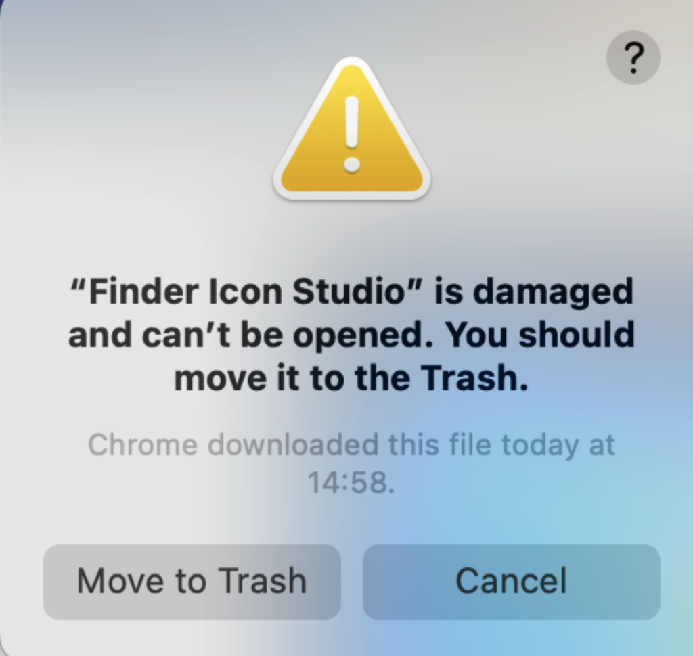

# Finder Icon Studio

Finder Icon Studio is a small macOS utility for customizing Finder item icons.

You can:

- Change a folder/file icon color
- Use a photo as an icon
- Restore the original icon
- Keep file and folder names unchanged
- Use it locally, with no account and no cloud service

## Download

Download the latest app from the GitHub Releases page:

[Finder Icon Studio v0.1.0](https://github.com/giorgichkhikvadze929-dev/FinderIconStudio/releases/tag/v0.1.0)

You can also find the zip in this repo:

[dist/Finder Icon Studio.zip](dist/Finder%20Icon%20Studio.zip)

## Install

1. Download `Finder Icon Studio.zip`.
2. Double-click the zip to unzip it.
3. Move `Finder Icon Studio.app` into your `Applications` folder.
4. Right-click `Finder Icon Studio.app`.
5. Click `Open`.
6. Click `Open` again if macOS asks for confirmation.

## If macOS Says the App Is Damaged

Because this is an early unsigned macOS app, Gatekeeper may show this warning:



This usually does **not** mean the app is broken. It means macOS blocked an unsigned app downloaded from the internet.

If right-click > Open still does not work, run this in Terminal:

```sh
xattr -dr com.apple.quarantine "/Applications/Finder Icon Studio.app"
```

Then open the app again.

## Current Status

This is an early beta. It is not code-signed or notarized yet.

For a smoother public release, the app should eventually be signed and notarized with an Apple Developer account.

## Roadmap Ideas

- Code signing and notarization
- Finder right-click extension packaging
- Better onboarding for macOS security prompts
- More icon presets

## License

License not selected yet.
