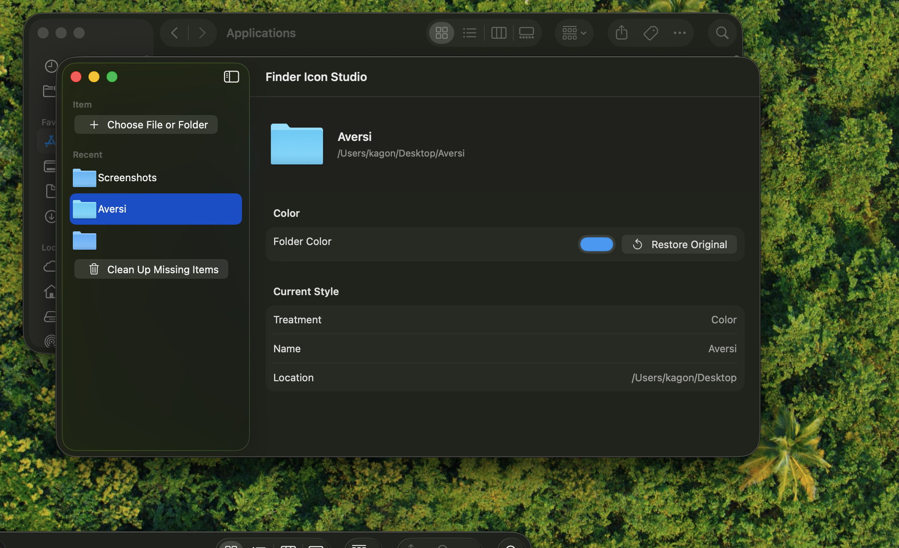

# Finder Icon Studio

Finder Icon Studio is a small macOS utility for customizing Finder item icons.

You can:

- Change a folder/file icon color
- Use a photo as an icon
- Restore the original icon
- Keep file and folder names unchanged
- Use it locally, with no account and no cloud service



## Download

Download the latest app zip from:

[dist/Finder Icon Studio.zip](dist/Finder%20Icon%20Studio.zip)

If this is on GitHub, you can also attach the same zip to a GitHub Release.

## Install

1. Download `Finder Icon Studio.zip`.
2. Double-click the zip to unzip it.
3. Move `Finder Icon Studio.app` into your `Applications` folder.
4. Right-click `Finder Icon Studio.app`.
5. Click `Open`.
6. Click `Open` again if macOS asks for confirmation.

## If macOS Says the App Is Damaged

Because this is an early unsigned macOS app, Gatekeeper may show this warning:


This usually does **not** mean the app is broken. It means macOS blocked an unsigned app downloaded from the internet.

For local testing, run this in Terminal:

```sh
xattr -dr com.apple.quarantine "/Applications/Finder Icon Studio.app"
```

Then open the app again.

## Current Status

This is an early beta. It is not code-signed or notarized yet.

Known macOS distribution limitation:

- Unsigned downloads may require right-click > Open.
- Some Macs may show the damaged-app warning until quarantine is removed.

For a smoother public release, the app should eventually be signed and notarized with an Apple Developer account.

## Build From Source

Requirements:

- macOS
- Xcode Command Line Tools
- Swift

Build:

```sh
swift build -c release
```

Run locally:

```sh
swift run FinderIconStudio
```

## Project Files

- `Sources/FinderIconStudio` - SwiftUI macOS app
- `Sources/FinderIconStudioCore` - icon customization logic
- `FinderSyncExtension` - Finder Sync extension source for a future Finder right-click integration
- `Assets` - app icon source and iconset files
- `dist/Finder Icon Studio.zip` - downloadable app zip

## Roadmap Ideas

- Code signing and notarization
- Finder right-click extension packaging
- Better onboarding for macOS security prompts
- More icon presets

## License

License not selected yet.
